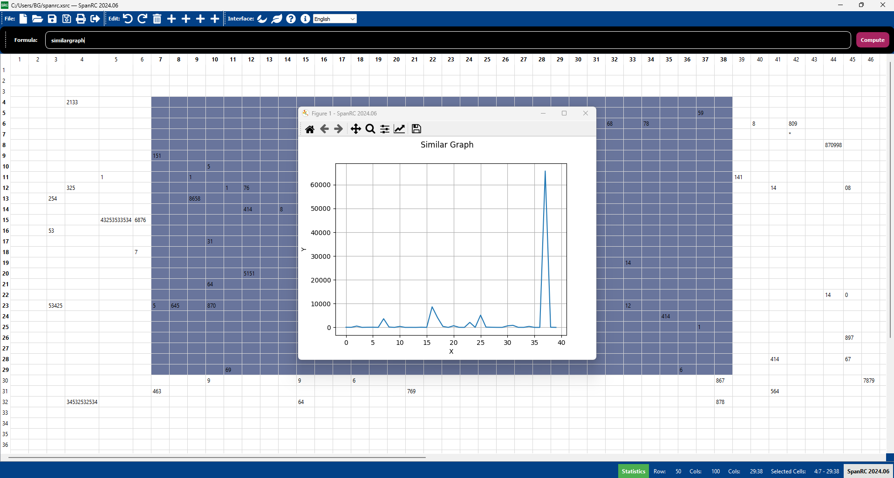

# SpanRC - A Lightweight Spreadsheet Editor



SpanRC is a lightweight spreadsheet editor written in Python, utilizing the PyQt5 library for its graphical interface. It offers a straightforward alternative to traditional spreadsheet applications, emphasizing simplicity and efficiency.

## Features

- [x] **File Operations**: Open and save CSV & XSRC files (SpanRC Files).
- [x] **Printing**: Print or export tables to PDF format.
- [x] **Editing**: Modify tables with options to delete, edit rows, and columns.
- [x] **Formula Support**: Includes functions like avg, sum, min, max, count, similargraph, etc.
- [x] **Customizable Toolbar**: Tailor the interface to your needs.
- [x] **Performance**: Fast and lightweight with threading support.
- [x] **User Experience**: Alerts for unsaved changes and supports dark/light mode.
- [x] **Real-Time Statistics**: Displays live updates on row count, column count, and cell count.
- [x] **Multilingual**: Available in English, Turkish, German, Spanish, Azerbaijani.
- [x] **Cross-Platform**: Compatible with Windows, macOS, and Linux.
- [x] **Efficiency**: Designed for power-saving and utilizes hardware acceleration.

## Prerequisites

- Python 3.6+
- PyQt5

## Installation

1. Clone the repository:

   ```bash
   git clone https://github.com/berkaygediz/SpanRC.git
   ```

2. Install requirements:

   ```bash
   pip install -r requirements.txt
   ```

## Usage

Launch SpanRC from the command line:

```bash
python SpanRC.py
```

## Contributing

Contributions to the SpanRC project are encouraged. Please refer to [CONTRIBUTING.md](CONTRIBUTING.md) for details on how to contribute and our code of conduct.

## License

This project is licensed under GNU GPLv3, GNU LGPLv3, and Mozilla Public License Version 2.0.
